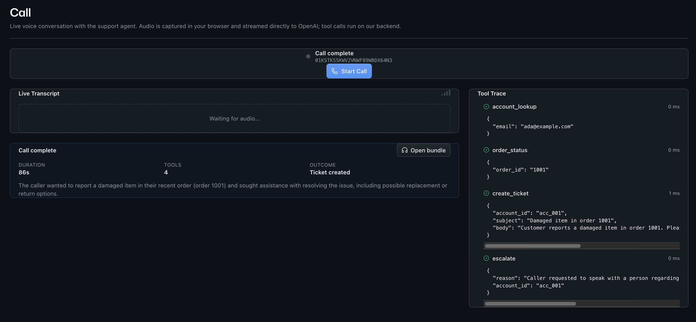
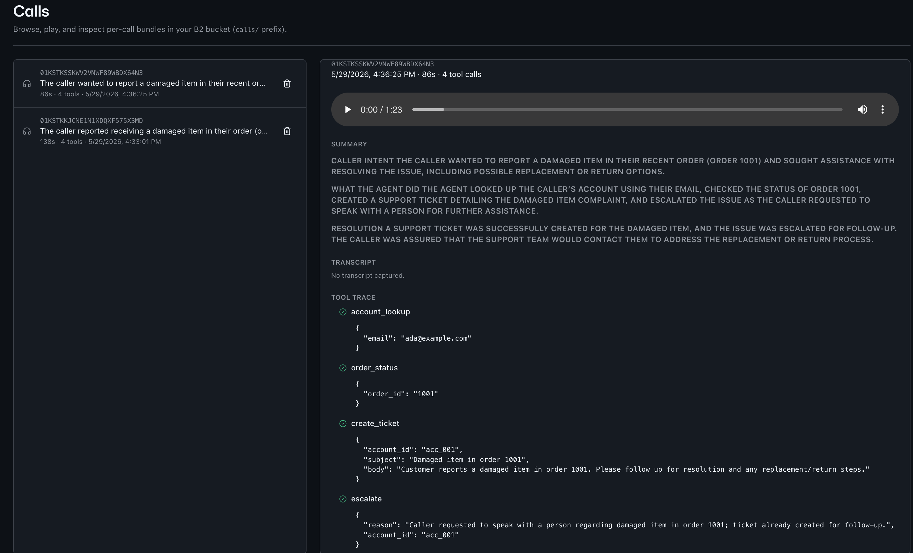
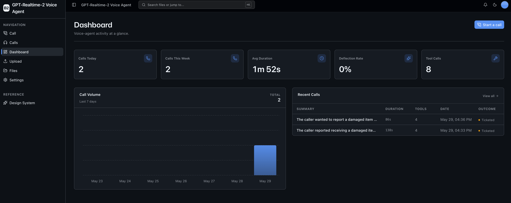

<!-- last_verified: 2026-05-28 -->
# GPT-Realtime-2 Customer Support Voice Agent

A browser-based customer-support voice agent powered by **OpenAI's GPT-Realtime-2** model. Click **Start Call**, talk to the agent in natural full-duplex audio (interrupt freely), and the agent invokes mock helpdesk tools (`account_lookup`, `order_status`, `create_ticket`, `escalate`) to actually resolve the request. The moment the call ends, the app persists a complete **call bundle** — WAV audio, transcript, tool trace, Markdown summary, manifest — to [Backblaze B2](https://blze.ai/storage).

This is a reference sample for developers evaluating OpenAI's Realtime API for production support workflows, and a credible demonstration that audio + AI artifacts pile up fast in object storage.

## What it looks like

**Live call console** (`/call`) — talk to the agent in full-duplex audio; the transcript streams in and tool calls fire in real time.



**Calls explorer** (`/calls`) — browse persisted call bundles from B2: play the audio, read the transcript, summary, and tool trace.



**Support dashboard** (`/`) — call volume, average duration, tool-call breakdown, and deflection rate at a glance.



**What you get out of the box:**
- Full-duplex WebRTC voice loop, direct client↔OpenAI (server only mints ephemeral session tokens)
- Mock CRM/helpdesk tool calling with a `CrmAdapter` Protocol that swaps in for Zendesk/Intercom/etc later
- Per-call bundles written to B2 under `calls/<call_id>/`: `audio.wav`, `transcript.jsonl`, `tools.jsonl`, `summary.md`, `manifest.json`
- Sample-specific **Calls** explorer (`/calls`) scoped to the `calls/` prefix — list, play audio, view transcript + summary + tool trace, delete bundle
- Full bucket explorer (`/files`) kept from the starter kit for ops use
- Support dashboard with call volume, average duration, tool-call breakdown, deflection rate
- FastAPI backend with the same strict layered architecture, structural tests, and 300-line file cap as the starter kit
- Agent-optimized docs (`AGENTS.md`, `ARCHITECTURE.md`, `docs/features/`)

## Architecture at a glance

```
Browser  ──audio/WebRTC──>  OpenAI Realtime  (direct, no server hop)
   │                              │
   │                              │ tool-call events
   │                              ▼
   │   tool dispatch     ┌──────────────────┐
   ├────────────────────>│  FastAPI backend │── B2 (S3 API) ──> Backblaze B2
   │                     │  (mints tokens,  │      audio + transcript + tools
   │                     │   runs tools,    │      + summary + manifest
   │                     │   writes bundle) │
   │                     └──────────────────┘
   ▼
/calls explorer  <── presigned audio URL ──  Backblaze B2
```

See [ARCHITECTURE.md](ARCHITECTURE.md) for the full layered breakdown and data flows.

## Quick Start

You need: Node.js >= 20, pnpm >= 9, Python >= 3.11, a free **[Backblaze B2 account](https://blze.ai/storage)**, and an **[OpenAI API key](https://platform.openai.com/api-keys)** with Realtime access.

### 1. Install dependencies

```bash
pnpm install
```

### 2. Set up the backend

```bash
cd services/api
python -m venv .venv && source .venv/bin/activate
pip install -r requirements.txt
cd ../..
```

### 3. Add your credentials

```bash
cp .env.example .env
```

Then in `.env`:

- **Backblaze B2** — create a bucket and application key at the [B2 dashboard](https://secure.backblaze.com/b2_buckets.htm?utm_source=github&utm_medium=referral&utm_campaign=ai_artifacts&utm_content=b2ai-gpt-realtime-2-customer-support-voice-agent), then paste:
  - `B2_BUCKET_NAME` — Bucket Unique Name
  - `B2_ENDPOINT` — S3 endpoint shown on the bucket page
  - `B2_APPLICATION_KEY_ID` — keyID (Read+Write on the bucket)
  - `B2_APPLICATION_KEY` — applicationKey (shown once)
  - `B2_REGION` — e.g. `us-west-004`
- **OpenAI** — paste your API key into `OPENAI_API_KEY`. Optionally override `OPENAI_REALTIME_MODEL` (default `gpt-realtime-2`) and `OPENAI_SUMMARY_MODEL` (default `gpt-4.1-mini`).

> Walkthroughs: [create a bucket](https://www.backblaze.com/docs/cloud-storage-create-and-manage-buckets?utm_source=github&utm_medium=referral&utm_campaign=ai_artifacts&utm_content=b2ai-gpt-realtime-2-customer-support-voice-agent) · [create app keys](https://www.backblaze.com/docs/cloud-storage-create-and-manage-app-keys?utm_source=github&utm_medium=referral&utm_campaign=ai_artifacts&utm_content=b2ai-gpt-realtime-2-customer-support-voice-agent).

### 4. Run it

```bash
pnpm dev
```

Frontend at `localhost:3000`, API at `localhost:8000`. Click **Call** in the sidebar and start talking.

`pnpm dev` runs `pnpm doctor` first — preflight checks for Node/Python/pnpm versions, venv presence, `.env` completeness (including `OPENAI_API_KEY`), and port availability. Run it standalone any time with `pnpm doctor`.

## Core Features

- [Realtime Voice](docs/features/realtime-voice.md) — full-duplex WebRTC loop, ephemeral session tokens, barge-in handling
- [Tool Calling](docs/features/tool-calling.md) — `account_lookup`, `order_status`, `create_ticket`, `escalate` via a `CrmAdapter` Protocol (mock impl ships, real CRM impls are an explicit extension point)
- [Call Bundles](docs/features/call-bundles.md) — `calls/<call_id>/` layout, write order, partial-failure semantics
- [Calls Explorer](docs/features/calls-explorer.md) — sample-specific Library view at `/calls`
- [Dashboard](docs/features/dashboard.md) — call volume, average duration, tool-call breakdown, deflection rate
- [File Browser](docs/features/file-browser.md) — full bucket explorer (operator view), kept from the starter kit
- [File Upload](docs/features/file-upload.md) — reference upload surface for seeding documents into the bucket

## Tech Stack

- TypeScript, Next.js 16, React 19, Tailwind v4, shadcn/ui, Recharts, TanStack Query
- Python 3.11+, FastAPI, boto3, Pydantic v2, `openai` SDK (non-realtime calls only)
- Backblaze B2 (S3-compatible object storage)
- OpenAI Realtime API (`gpt-realtime-2`) via WebRTC, client-direct
- pnpm workspaces

## Commands

| Command | What it does |
|---------|-------------|
| `pnpm dev` | Start frontend + backend |
| `pnpm dev:web` | Frontend only |
| `pnpm dev:api` | Backend only |
| `pnpm build` | Build frontend |
| `pnpm lint` | Lint frontend (eslint) |
| `pnpm lint:api` | Lint backend (ruff) |
| `pnpm test:api` | Backend tests (pytest) |
| `pnpm check:structure` | Verify layering, SDK containment, file-size rules |
| `pnpm test:e2e` | Playwright e2e (run `pnpm --filter @gpt-realtime-2-customer-support-voice-agent/web exec playwright install chromium` once first) |

## Documentation Map

| Doc | Purpose |
|-----|---------|
| [AGENTS.md](AGENTS.md) | Agent table of contents — start here |
| [ARCHITECTURE.md](ARCHITECTURE.md) | System layout, layering, data flows |
| [docs/features/](docs/features/) | Feature docs (realtime, tools, bundles, explorer, dashboard, browser, upload) |
| [docs/app-workflows.md](docs/app-workflows.md) | User journeys |
| [docs/dev-workflows.md](docs/dev-workflows.md) | Engineering workflows + how to mock the Realtime API |
| [docs/SECURITY.md](docs/SECURITY.md) | Security principles (incl. OpenAI key handling) |
| [docs/RELIABILITY.md](docs/RELIABILITY.md) | Reliability + partial-failure semantics for bundles |
| [docs/design-system.md](docs/design-system.md) | Design tokens, primitives, AI elements, loader, error/empty states |
| [docs/exec-plans/](docs/exec-plans/) | Execution plans and tech debt tracker |

## Contributing

Start with [AGENTS.md](AGENTS.md). It's the map — everything else is discoverable from there.

## License

MIT License — see [LICENSE](LICENSE).
